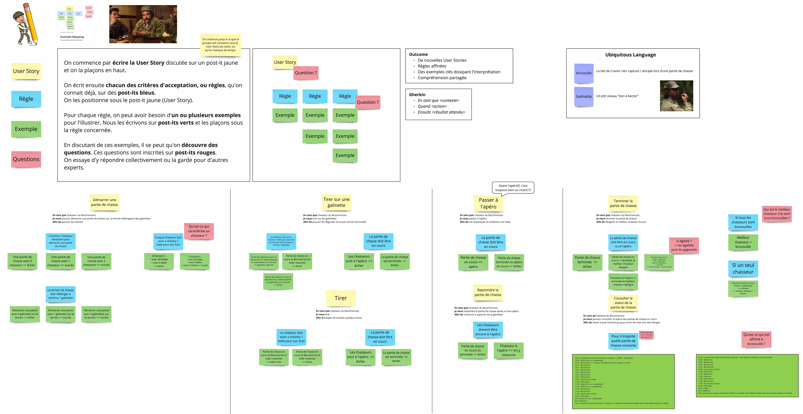
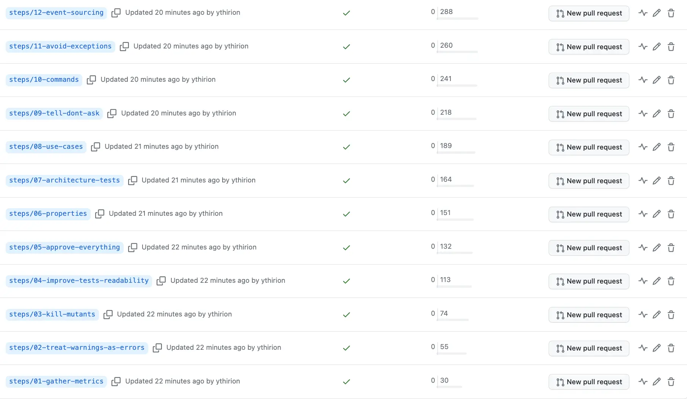

# Refactoring du Bouchonnois

Ce kata a pour objectif de s'exercer au refactoring sur un code existant afin de :
- Identifier certains `smells` dans notre code
- Comprendre quelle pratique et/ou outil peuvent nous aider pour surpasser ces `smells`
- Pratiquer dans 1 environnement `safe` en dehors de son code de production

## Le contexte
Nos vaillants chasseurs du Bouchonnois ont besoin de pouvoir gérer leurs parties de chasse.  
Ils ont commencé à faire développer 1 système de gestion par l'entreprise `Toshiba` mais ne sont pas satisfaits.  

L'entreprise leur parle d'une soit-disante `dette technique` qui les ralentit dans le développement de nouvelles features...

Les chasseurs comptent sur nous pour améliorer la situation.

### Example Mapping
Ils ont fait quelques ateliers avec `Toshiba` et ont réussi à clarifier ce qui est attendu du système.

Pour ce faire, ils ont utilisé le format `Example Mapping` à découvrir [ici](https://xtrem-tdd.netlify.app/Flavours/Practices/example-mapping).

Voici l'Example Mapping qui a servi d'alignement pour développer ce système.

Version PDF disponible [ici](example-mapping/example-mapping.pdf)

## Facilitation
### Pré-requis
Le code est disponible en `C#` (`.NET 7`), `java`(21), `kotlin`.

Voici la liste des librairies utilisés / recommandées :

| .NET                                                                                          |
|-----------------------------------------------------------------------------------------------|
| [`xUnit`](https://xunit.net/)                                                                 |
| [`FluentAssertions`](https://fluentassertions.com/)                                           |
| [`Verify.xUnit`](https://github.com/VerifyTests/Verify)                                       |
| [`FSCheck`](https://fscheck.github.io/FsCheck/)                                               |
| [`TngTech.ArchUnitNET.xUnit`](https://archunitnet.readthedocs.io/en/latest/)                  |
| [`LanguageExt.Core`](https://github.com/louthy/language-ext)                                  |
| [`FluentAssertions.LanguageExt`](https://www.nuget.org/packages/FluentAssertions.LanguageExt) |

Afin d'améliorer le code on te propose de suivre les étapes ci-dessous :

- [1. Se faire une idée de la code base](facilitation/01.gather-metrics.md)
- [2. Treat Warnings as Errors](facilitation/02.treat-warnings-as-errors.md)
- [3. Let's kill some mutants](facilitation/03.kill-mutants.md)
- [4. Améliorer la lisibilité des tests](facilitation/04.improve-tests-readability.md)
- [5. "Approve" everything](facilitation/05.approve-everything.md)
- [6. "Properties" everywhere](facilitation/06.properties.md)
- [7. Tests d'architecture](facilitation/07.architecture-tests.md)
- [8. Use Cases](facilitation/08.use-cases.md)
- [9. Tell Don't Ask](facilitation/09.tell-dont-ask.md)
- [10. Commands](facilitation/10.commands.md)
- [11. Plus d'exceptions](facilitation/11.avoid-exceptions.md)
- [12. Event Sourcing](facilitation/12.event-sourcing.md)

Pour chaque étape :
- une proposition de solution "étape par étape" est proposée (en `C#` uniquement)
- il existe 1 branche / étape

### Objectifs pédagogiques
À travers ces différentes étapes j'ai essayé d'introduire les sujets suivants :
- Example Mapping
- Static Code Analysis / Linter
- Treat Warnings as Errors
- Mutation Testing
- Test Data Builders
- Approval Testing
- Automated Refactoring
- Property-Based Testing
- Tests d'Architecture
- Test-Driven Development
- Clean Architecture
- Domain Driven Design
- Tell Don't Ask
- Functional Programming
- Avoid Primitives
- Avoid Exceptions
- Architecture Decision Records
- Event Sourcing
- ...

Bon voyage 🤩
