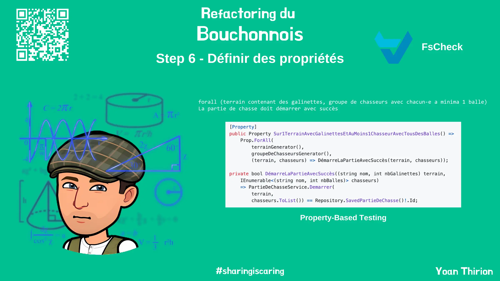

# Définir des propriétés
Avant de nous lancer dans notre refactoring, on peut encore aller plus loin sur nos tests afin d'améliorer encore notre confiance vis-à-vis de notre code base.

Pour ce faire on va écrire des `tests de propriétés` :
- Prendre du temps pour comprendre ce qu'est le [`Property-Based Testing`](https://xtrem-tdd.netlify.app/Flavours/Testing/pbt)
- Quelles propriétés peut-on identifier à partir de notre `Example Mapping` ?
- Ecrire des tests de propriétés en utilisant la librairie [FsCheck](https://fscheck.github.io/FsCheck/Properties.html)



## Démarrer une partie


On peut identifier des propriétés telles que :
```text
forall(terrain contenant des galinettes, groupe de chasseurs avec chacun-e a minima 1 balle)
La partie de chasse doit démarrer avec succès
```

Ou encore :
```text
forall(terrain sans galinettes, groupe de chasseurs avec au moins 1 chasseur sans balle)
La partie de chasse ne démarre pas car "pas de galinettes sur le terrain"
```

### Cas passant
- On commence par ajouter la dépendance sur `FsCheck`
```shell
dotnet add package FsCheck.xUnit
```

- On ajoute 1 test dans la classe `DemarrerUnePartieDeChasse`

```csharp
[Property] // Annotation pour xUnit
public Property Sur1TerrainAvecGalinettesEtAuMoins1ChasseurAvecTousDesBalles() =>
    Prop.ForAll(
        null,
        (terrain, chasseurs) => true
    );
```

- On doit travailler sur la génération d'un terrain valide

```csharp
private static Arbitrary<(string nom, int nbGalinettes)> terrainGenerator()
    => (from nom in Arb.Generate<string>()
        // A minima 1 galinette sur le terrain
        from nbGalinette in Gen.Choose(1, int.MaxValue)
        select (nom, nbGalinette)).ToArbitrary();
```

- Ensuite, on travaille sur la manière de générer des chasseurs valides

```csharp
private static Arbitrary<(string nom, int nbBalles)> chasseurGenerator()
    => (from nom in Arb.Generate<string>()
        // A minima 1 balle
        from nbBalles in Gen.Choose(1, int.MaxValue)
        select (nom, nbBalles)).ToArbitrary();
```

- On définit comment construire 1 groupe de chasseurs :

```csharp
private static Arbitrary<FSharpList<(string nom, int nbBalles)>> groupeDeChasseursGenerator()
    => // On définit le nombre de chasseurs dans le groupe [1; 1000]
        (from nbChasseurs in Gen.Choose(1, 1_000)
        // On utilise le nombre de chasseurs pour générer le bon nombre de chasseurs
        select chasseurGenerator().Generator.Sample(1, nbChasseurs)).ToArbitrary();
```

- On utilise les générateurs dans la propriété
```csharp
[Property]
public Property Sur1TerrainAvecGalinettesEtAuMoins1ChasseurAvecTousDesBalles() =>
    Prop.ForAll(
        terrainGenerator(),
        groupeDeChasseursGenerator(),
        (terrain, chasseurs) =>
        {
            var savedId = PartieDeChasseService.Demarrer(
                terrain,
                chasseurs.ToList()
            );
            return Repository.SavedPartieDeChasse()!.Id == savedId;
        }
    );
```

- On lance le test et vérifie les inputs générés


- On a alors 1 seul test qui va en fait valoir l'écriture de 100 tests

Pour ce test on a alors :
```csharp
private static Arbitrary<(string nom, int nbGalinettes)> terrainGenerator()
    => (from nom in Arb.Generate<string>()
        from nbGalinette in Gen.Choose(1, int.MaxValue)
        select (nom, nbGalinette)).ToArbitrary();

private static Arbitrary<(string nom, int nbBalles)> chasseurGenerator()
    => (from nom in Arb.Generate<string>()
        from nbBalles in Gen.Choose(1, int.MaxValue)
        select (nom, nbBalles)).ToArbitrary();

private static Arbitrary<FSharpList<(string nom, int nbBalles)>> groupeDeChasseursGenerator()
    => (from nbChasseurs in Gen.Choose(1, 1_000)
        select chasseurGenerator().Generator.Sample(1, nbChasseurs)).ToArbitrary();

[Property]
public Property Sur1TerrainAvecGalinettesEtAuMoins1ChasseurAvecTousDesBalles() =>
    Prop.ForAll(
        terrainGenerator(),
        groupeDeChasseursGenerator(),
        (terrain, chasseurs) => DémarreLaPartieAvecSuccès(terrain, chasseurs));

private bool DémarreLaPartieAvecSuccès((string nom, int nbGalinettes) terrain,
    IEnumerable<(string nom, int nbBalles)> chasseurs)
    => PartieDeChasseService.Demarrer(
        terrain,
        chasseurs.ToList()) == Repository.SavedPartieDeChasse()!.Id;
```

Cette propriété est complémentaire au test `DemarrerUnePartieDeChasse.AvecPlusieursChasseurs` qui valide la bonne instanciation de l'objet `PartieDeChasse` à partir d'un exemple.
Dans la propriété, on valide que la partie démarre sans se soucier de l'instanciation de la partie au sens du `Domain`.

### Cas non passant
Concernant les cas `non-passants`, nous allons les remplacer par des tests de propriétés.

- On commence par ce test :
```csharp
[Fact]
public void SansChasseurs()
    => ExecuteAndAssertThrow<ImpossibleDeDémarrerUnePartieSansChasseur>(
        s => s.Demarrer(("Pitibon sur Sauldre", 3), new List<(string, int)>()),
        p => p.Should().BeNull()
    );
```

- On le change en `Property`

```csharp
[Property]
public Property SansChasseursSurNimporteQuelTerrainRicheEnGalinette()
    => Prop.ForAll(
        // On réutilise le générateur de terrains riches en galinettes
        terrainGenerator(),
        terrain =>
        {
            // On va refactorer pour réutiliser cette logique
            try
            {
                PartieDeChasseService.Demarrer(
                    terrain,
                    new List<(string, int)>());

                return false;
            }
            catch (ImpossibleDeDémarrerUnePartieSansChasseur)
            {
                return Repository.SavedPartieDeChasse() == null;
            }
        });
```

- On crée une méthode qui va lancer l'action de manière `safe` et valider la lancement de l'exception

```csharp
protected bool MustFailWith<TException>(Action action, Func<PartieDeChasse?, bool>? assert = null)
    where TException : Exception
{
    try
    {
        action();
        return false;
    }
    catch (TException)
    {
        return assert?.Invoke(SavedPartieDeChasse()) ?? true;
    }
}

private bool EchoueAvec<TException>(
                (string nom, int nbGalinettes) terrain,
                IEnumerable<(string nom, int nbBalles)> chasseurs,
                Func<PartieDeChasse?, bool>? assert = null) where TException : Exception
                => MustFailWith<TException>(() => PartieDeChasseService.Demarrer(terrain, chasseurs.ToList()), assert);

[Property]
public Property SansChasseursSurNimporteQuelTerrainRicheEnGalinette()
    => ForAll(
        terrainRicheEnGalinettesGenerator(),
        terrain =>
            EchoueAvec<ImpossibleDeDémarrerUnePartieSansChasseur>(
                terrain,
                PasDeChasseurs,
                savedPartieDeChasse => savedPartieDeChasse == null)
```

## Autres propriétés
D'autres propriétés pourraient être définies sur d'autres classes de tests.

Nouveau rapport `SonarCloud` disponible [ici](https://sonarcloud.io/summary/overall?id=ythirion_refactoring-du-bouchonnois&branch=steps%2F06-properties).

## Reflect
- Que pensez vous de cette technique ?
- Quelles sont ses avantages ?
- Comment vous pourriez l'utiliser ?

